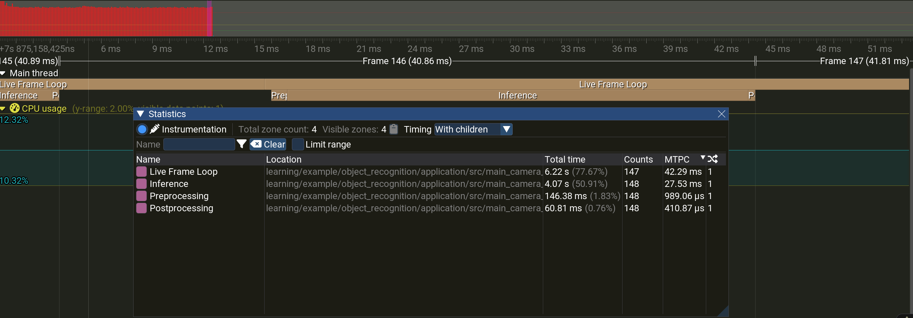
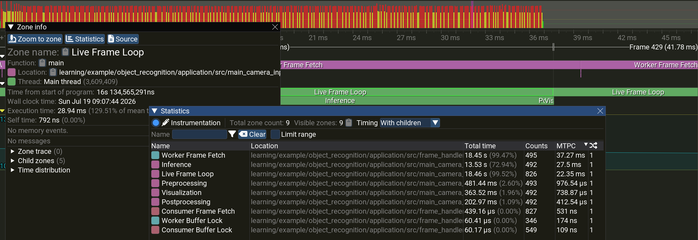
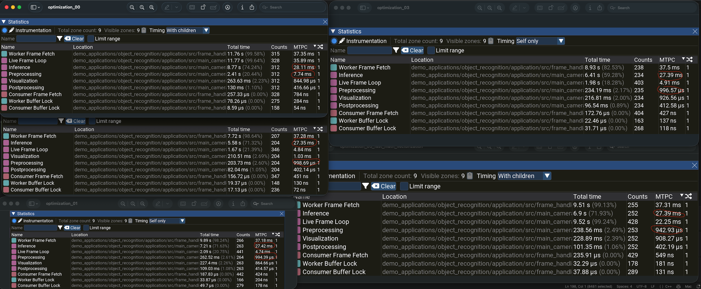

Performance Profiling
---------------------

.. note::
    The performance measurements currently are done on a MacBook Pro with Apple M5 chip, 32 GB RAM. The performance measurements may vary on different hardware and software configurations. Once the application is developed, it will be tested on Raspberry Pi 5.

Following figure shows initial performance measurement of the object recognition pipeline, which is not optimized and runs on a single thread. The inference and preprocessing are done sequentially, which results in lower throughput and higher latency.

.. figure:: perf_initial_measurement.png
   :align: center
   :alt: First performance measurement of the object recognition pipeline.

Following figure shows optimized performance measurement of the object recognition pipeline, which runs on a single thread. The inference and preprocessing are done sequentially, but the code is optimized for better performance, minimal memory copies, and dynamic allocation in hot path. Still single-threaded execution with no specific hardware acceleration is used, which results in better throughput and lower latency compared to the initial measurement.

Following figure shows optimized performance measurement of the object recognition pipeline, which runs on two threads. The inference and preprocessing are done in parallel with the reading the frames from the camera, which results in better throughput and lower latency compared to the single-threaded execution.

.. note::
    To compare the performance benefit between single-threaded and multi-threaded execution, we have to take into account the total time taken to process all frames within the measurement window.

    In given example for 30fps (33.3ms per frame) camera stream the single-threaded execution for one frame in average takes ~42ms, which results in 23.8fps throughput, less than the camera stream, meaning that output result is late for about ~9ms.
    The multi-threaded execution for one frame in average takes ~37ms, which results in ~27fps throughput, still less than the camera stream, but better than the single-threaded execution, meaning that output is still late, but for about ~3ms, which is better than the single-threaded execution.

    There is no lagging in the output, i.e. the inference result is always related to the latest frame, but the output is late for a few milliseconds, which is acceptable in most cases. The multi-threaded execution is better than the single-threaded execution, but still not optimal. The optimal solution would be to use hardware acceleration for inference and preprocessing, which will be done in following steps.

Following figure shows performance with utilizing different compiler optimization levels.
Optimization level useds are:
    - O0: No optimization, -copt=-O0.
    - O1: Some optimization, -copt=-O1.
    - O2: More optimization, -copt=-O2.
    - O3: Maximum optimization, -copt=-O3,-ffast-math,-fvectorize,-flto.

From the figure above we can see huge difference in performance between no optimization and some optimization, primarily for Preprocessing part. Note that inference part is not affected, since the dependency on the ONNX Runtime library is handled via `cc_import` Bazel rule. Optimization level 00 takes masive 7.74ms per Preprocessing frame, while using optimization level 01 reduces Preprocessing of frame to under 1ms, which is huge difference. Further optimization levels 02 and 03 do not bring significant performance improvements. However, with optimization level 03 where -fast-math and -vectorize flags are used, additional ~50us improvement is achieved for Preprocessing, which is not significant, but still measurable.

.. note::
    Since shared library for ONNX Runtime is from official Microsoft release, it is assumed that it is optimized for best performance, and further optimization is not desired. However, if the ONNX Runtime library is built from source, it can be optimized for specific hardware and software configuration, which may bring additional performance improvements.