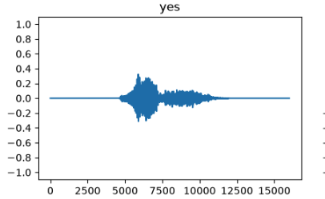
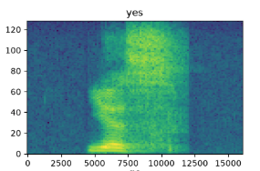

===============================
Audio Recognition
===============================

This document details the universal signal processing and mathematical foundations 
used to transform physical sound waves into structured inputs for deep learning models.

Physical Sound to Digital Waveforms
-----------------------------------

Acoustic Sampling
~~~~~~~~~~~~~~~~~
Sound propagates as a continuous analog pressure wave through a medium. To process 
sound digitally, it must undergo analog-to-digital conversion (ADC) via temporal 
discretization. This process samples the wave's amplitude at fixed intervals defined 
by the **Sampling Rate** (:math:`f_s`), measured in Hertz (Hz).

According to the **Nyquist-Shannon Sampling Theorem**, the sampling rate must be at 
least twice the highest frequency component (:math:`f_{\text{max}}`) present in the analog signal 
to prevent aliasing:

.. math::

   f_s > 2 \cdot f_{\text{max}}

If the continuous signal is :math:`x(t)`, its discrete representation is a 1D vector:

.. math::

   x[n] = x(n \cdot T_s) = x\left(\frac{n}{f_s}\right)

Where:
* :math:`n` is the discrete time index integer.
* :math:`T_s` is the sampling period (:math:`\frac{1}{f_s}`).

Time-Domain Representation
~~~~~~~~~~~~~~~~~~~~~~~~~~

A time-domain representation plots the continuous fluctuations of an acoustic 
signal over a linear chronological baseline. This format provides the raw structural 
foundation for all subsequent digital signal processing operations.

    
   Visual representation of a 1D discrete time-domain audio signal.

   **X-Axis (Discrete Time):** Represents sequential sample indices running 
   chronologically from left to right. For a :math:`16\text{ kHz}` recording, 
   the indices run from 0 to 16,000, representing exactly 1 second of total 
   elapsed time.

   **Y-Axis (Instantaneous Amplitude):** Tracks normalized floating-point air 
   pressure fluctuations. The center baseline (:math:`0.0`) represents absolute 
   silence, while values oscillate sequentially between positive compression 
   phases and negative rarefaction phases.

.. note::
    In diagram it looks like the signal on y-axis expands in both directions simultaneously, but in reality, the signal is a high-speed pendulum that rapidly swings between positive compression and negative rarefaction over time, so at any given microsecond, the signal is either in compression or rarefaction, but not both. If one were to zoom in on a single microsecond, the signal would appear as a single point either above or below the baseline, never both.

The Physics of Sound: Compression and Rarefaction
~~~~~~~~~~~~~~~~~~~~~~~~~~~~~~~~~~~~~~~~~~~~~~~~~
In the physical world, sound is a mechanical longitudinal wave of kinetic energy 
that travels through an elastic medium (such as air). It does not move material 
permanently forward; instead, it causes local air molecules to oscillate back 
and forth parallel to the direction of the wave propagation. 

This mechanical movement creates alternating physical states:

* **Compression (Positive Direction):** As a sound source (e.g., vocal cords) 
  moves outward, it pushes neighboring air molecules forward. This packs the 
  molecules tightly together, creating a localized zone of high density and 
  **high pressure**. When these molecules strike a microphone diaphragm, they 
  push it inward, generating a positive voltage trace above the :math:`0.0` 
  resting baseline.
* **Rarefaction (Rarefraction) (Negative Direction):** As the sound source 
  recoils, it leaves behind an empty pocket of space. The air molecules rush 
  backward to fill this gap, spreading themselves thin and creating a localized 
  zone of low density and **low pressure** (a partial vacuum). This pulls the 
  microphone diaphragm outward, generating a negative voltage trace below the 
  :math:`0.0` resting baseline.

Because sound cannot propagate without a repeating cycle of displacement and 
recoil, an audio signal never expands in both directions simultaneously at a single 
fraction of a microsecond. Instead, it acts like a high-speed pendulum, rapidly 
swinging between positive compression and negative rarefaction over time.

Digital Quantization and Amplitude Normalization
~~~~~~~~~~~~~~~~~~~~~~~~~~~~~~~~~~~~~~~~~~~~~~~~
When analog electrical voltage leaves a microphone, an Analog-to-Digital Converter 
(ADC) measures its amplitude at fixed intervals. The precision of these discrete 
measurements depends heavily on the system's **Bit Depth**. 

For example, a standard 16-bit audio registration records amplitudes as absolute signed 
integers ranging anywhere from :math:`-32,768` to :math:`+32,767`. Processing such large, 
variable integer ranges directly inside a machine learning network is problematic, 
as unscaled inputs can destabilize weight updates and cause exploding gradients.

To solve this, the pipeline applies **Peak Amplitude Normalization**. This process mathematically 
scales the entire discrete vector linearly so that the absolute maximum peak maps 
precisely to a floating-point target boundary of :math:`\pm 1.0`:

.. math::

   x_{\text{norm}}[n] = \frac{x[n]}{\max(|x|)}

This transformation yields several distinct advantages:

#. **Hardware Independence:** Normalization strips away raw voltage differences, ensuring that a voice command recorded on a low-voltage microphone matches the numerical scale of a recording made on high-end studio equipment.
* **Clipping Diagnostics:** The scale creates a clear boundary. If an incoming signal peak strikes the absolute limits at :math:`+1.0` or :math:`-1.0`, it signals **digital clipping**, a destructive state where the tops of the waveforms are squared off and permanently corrupted.
* **Gradient Optimization:** Constraining features strictly within a fractional :math:`[-1.0, 1.0]` envelope centers the incoming distribution around the mathematical zero-point, optimizing the network for standard weight initializations and activation functions.

    

The Short-Time Fourier Transform (STFT)
---------------------------------------

Fourier Transform Limitations
~~~~~~~~~~~~~~~~~~~~~~~~~~~~~
The standard Discrete Fourier Transform (DFT) converts a global signal into its component 
frequencies. However, it discards all timing data, assuming the frequencies present 
exist statically across the entire duration of the audio clip. Because speech and audio 
are highly dynamic and non-stationary, the standard DFT is insufficient.

Why the STFT is Needed: Navigating the Limitations of Raw Audio and Global DFTs
~~~~~~~~~~~~~~~~~~~~~~~~~~~~~~~~~~~~~~~~~~~~~~~~~~~~~~~~~~~~~~~~~~~~~~~~~~~~~~
To extract meaningful patterns from sound, a machine learning model needs a representation 
that captures both **chronological progression** and **spectral density**. Neither a raw 
time-domain waveform nor a standard global DFT can provide both simultaneously.

1. Why Raw Time-Domain Waves are Insufficient
^^^^^^^^^^^^^^^^^^^^^^^^^^^^^^^^^^^^^^^^^^^^^
A raw digital audio waveform tracks only one metric: the instantaneous amplitude of air 
pressure variations over time. While this vector contains all the raw data necessary to 
reproduce the sound, it hides vital acoustic signatures inside complex, overlapping 
oscillations. 

For instance, when a person speaks, their vocal tract creates specific resonant frequencies 
called **formants**. To a neural network, identifying a vowel directly from a raw 1D 
amplitude line requires deciphering thousands of rapid, interfering zig-zag patterns. 
The network must burn significant computational capacity just trying to infer the 
underlying pitch and timbre, making raw audio highly inefficient for complex classification.

2. Why Global DFTs Fail for Dynamic Audio
^^^^^^^^^^^^^^^^^^^^^^^^^^^^^^^^^^^^^^^^^
To expose hidden pitches, the standard Discrete Fourier Transform (DFT) breaks a 1D signal 
apart and calculates the global volume of every frequency present across the entire file. 
However, it does this by integrating across the entire timeline, which destroys all 
temporal anchors. 

If an audio clip contains the word *"yes"* (*"y"*, then *"eh"*, then *"ss"*), a global DFT 
shows the exact same output as if the clip contained the sounds reversed (*"ss"*, then 
*"eh"*, then *"y"*), or even played simultaneously as an unreadable chord. Because speech 
meaning depends entirely on the sequential arrangement of phonetic sounds, a global DFT is 
unusable for dynamic audio recognition.

3. The STFT Solution
^^^^^^^^^^^^^^^^^^^^
The Short-Time Fourier Transform resolves these issues by refusing to look at the audio 
as just a raw timeline or just a global frequency block. Instead, it breaks the non-stationary 
signal into a series of brief, localized time slices called **frames**. 

Because these frames are short (typically 20 to 40 milliseconds), the audio signal within 
each individual window can be treated as approximately **quasi-stationary**—meaning its 
pitch does not change drastically within that split second. By running a localized DFT 
sequentially on each slice, the STFT successfully extracts a rolling snapshot of changing 
frequencies, providing a 2D map that preserves both the structural timeline and the 
acoustic traits of the spoken word.

The Windowing Principle
------------------------

To capture frequency changes over time, the signal is divided into short, 
overlapping segments called frames. A localized mathematical function, 
known as a **Window Function** (:math:`w[n]`, such as a Hann or Hamming 
window), multiplies the signal frame. 

Windowing tapers the edges of each audio segment to zero. This smoothing 
minimizes artificial sharp cuts at the frame boundaries, preventing a 
mathematical distortion known as **Spectral Leakage**.

The Mathematical Impact of Windowing
~~~~~~~~~~~~~~~~~~~~~~~~~~~~~~~~~~~~

When you isolate a short segment of a continuous audio waveform, you are 
mathematically multiplying the infinite signal by a rectangular window. This 
abrupt truncation forces the signal to drop sharply to zero at the boundaries. 

If an active audio wave cycle is cut off mid-peak, this artificial 
step-discontinuity acts like a sharp click in the audio. In the frequency 
domain, representing a sharp edge requires infinite high-frequency 
components. As a result, energy from the true frequency "leaks" across 
the entire spectrum, muddying your data and introducing artificial noise.

Bridging the Math to Hyperparameters
~~~~~~~~~~~~~~~~~~~~~~~~~~~~~~~~~~~~

To prevent this spectral leakage, the Short-Time Fourier Transform (STFT) 
applies the **Hann Window Function**:

.. math::

   w[n] = 0.5 \cdot \left(1 - \cos\left(\frac{2\pi n}{\text{FRAME_LENGTH} - 1}\right)\right)

By multiplying the signal frame by this curve, the audio smoothly tapers to 
zero at both indices ``0`` and ``FRAME_LENGTH - 1``. 

However, this dampening introduces a new engineering challenge: **Amplitude Loss**. 
Because the Hann window suppresses data at the edges of the ``256``-sample window, 
any crucial acoustic information (like a fast vowel formant transition) occurring 
at those boundaries would be heavily attenuated and completely lost to a downstream 
neural network.

The Necessity of the 50% Overlap
~~~~~~~~~~~~~~~~~~~~~~~~~~~~~~~~

To recover this suppressed data, an overlapping strategy is mandatory. By 
setting ``FRAME_STEP = 127`` alongside a ``FRAME_LENGTH = 256``, the system 
achieves a ~50% overlap. 

.. code-block:: text

   Frame 1:    /--------\
   Frame 2:         /--------\      <-- 50% Overlap
   Summed:     ==============       <-- Constant Gain (COLA)

When you slide the window forward by only 127 samples instead of the full 256, 
the peak amplitude of *Frame 2* aligns precisely with the attenuated edge of 
*Frame 1*. 

This specific configuration satisfies the **Constant Overlap-Add (COLA)** 
constraint. Because the mathematical curves complement each other perfectly, 
summing the overlapping windows results in a flat, constant reconstruction 
gain across the timeline. No audio data is dropped, and no artificial amplitude 
modulation is introduced into the spectrogram.

STFT Formulation
~~~~~~~~~~~~~~~~
The **Short-Time Fourier Transform (STFT)** maps the 1D time-domain signal into a 2D 
complex-valued matrix by computing a localized DFT on each windowed segment as it slides 
across the timeline:

.. math::

   X(m, \omega) = \sum_{n=-\infty}^{\infty} x[n] w[n - m] e^{-j \omega n}

Where:
* :math:`x[n]` is the discrete time-domain input signal.
* :math:`w[n - m]` is the shifted window function at time frame index :math:`m`.
* :math:`\omega` is the continuous localized angular frequency variable.
* :math:`e^{-j \omega n}` represents the complex sinusoidal basis function.

Spectrogram Representation
---------------------------

Power and Magnitude Spectrograms
~~~~~~~~~~~~~~~~~~~~~~~~~~~~~~~~
The raw output of an STFT, :math:`X(m, \omega)`, consists of complex numbers containing both 
magnitude and phase details. For pattern recognition, phase data is often omitted. 

A **Magnitude Spectrogram** is created by taking the absolute value of the complex matrix. 
Squaring this result yields the **Power Spectrogram**, which measures the energy density 
of specific frequencies over time:

.. math::

   P(m, \omega) = |X(m, \omega)|^2

Logarithmic Scaling
~~~~~~~~~~~~~~~~~~
Raw power spectrograms often suffer from large amplitude disparities, where a few high-energy 
frequencies drown out subtle background details. This clashes with machine learning 
optimization, as extreme variations create unstable training gradients.

Furthermore, human perception of loudness is inherently non-linear and logarithmic. The 
human ear perceives equal ratios of power as equal steps in loudness. To bridge this 
gap and normalize the data distribution, power scales are compressed using a natural 
or base-10 logarithm:

.. math::

   S_{\text{log}}(m, \omega) = \ln\left(P(m, \omega) + \epsilon\right)

Where:
* :math:`\epsilon` is an infinitesimal positive floor value (such as floating-point machine epsilon) that prevents calculating the logarithm of zero in silent intervals.

Pattern Recognition on 2D Tensors
---------------------------------

Time-Frequency Translation
~~~~~~~~~~~~~~~~~~~~~~~~~~
The resulting log-spectrogram is a structural 2D grid. The horizontal axis maps 
progressive **Time Blocks**, while the vertical axis maps discrete **Frequency Bins**. 
The numerical value at any grid coordinate represents the signal's energy intensity.

Spatial Invariance in Audio
~~~~~~~~~~~~~~~~~~~~~~~~~~~
By representing audio as a 2D matrix, the signal behaves like a single-channel, grayscale 
image. This allows mathematical concepts from spatial computer vision to apply to audio:

* **Local Features**: Phonemes, accents, and tones form distinct visual clusters of energy across specific time-frequency zones.
* **Shift Invariance**: A sound spoken a fraction of a second later simply shifts horizontally on the time axis, while a sound pitched slightly higher shifts vertically on the frequency axis. 
* **Feature Extraction**: 2D matrix operations slide receptive fields across this grid to isolate transient boundaries, formant transitions, and acoustic signatures independently of where they occur in the audio clip.
